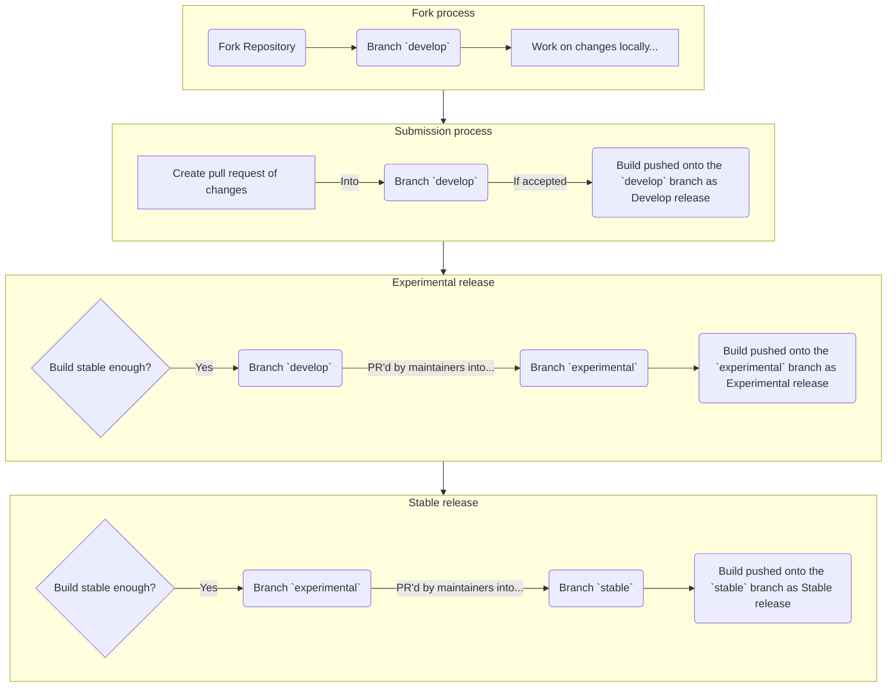

# PolyScript Engine Library
PolyScript is a settings engine library, is a library that allows tools created by developers to use build settings scripts for configuring build values based on the script settings in a dynamic variable-based fashion. Example uses for instance is resource processing (eg. emitting json files based on inputs, replacing variable keys with the actual parameters), PolyScript is the base engine for such tools.

PolyScript is not a build tool or script runner in itself, but an engine, it can be used within various tools that can use PolyScript configuration files for build settings, eg. `polyscript-jsonemitter`, a tool to emit variable-processed json files based on source json files for eg. build information, like a template system. PolyScript is mostly the engine for processing variables based on a project configuration file.

Please note that PolyScript is in early stages and heavily geared towards build info generation for Centuria project, its still rough and being worked on.

Furthermore...the engine has some performance issues, which makes it less suitable for quick command line tools and more purely usable for build tools, as loading a single setup environment already takes 2 seconds. This is mostly due to the variables system and plugin loading due to needing to load all jars into a class pool for scanning, contributions for fixing these issues are welcome.


# Documentation
- [User Documentation](docs/user) - User documentation, configuration of build settings for polyscript-powered tools
- [Developer Documentation](docs/developer) - Developer documentation, using PolyScript in your own tools


# Building

## Preparing development environment
PolyScript Engine uses the PolyTool build helper.

To set up the environment, simply, after cloning, run the following command within bash or Git bash on windows. Unfortunately PolyTool depends on a POSIX environment, so you will need to use git bash on windows.

Restoring the project:
```bash
./polytool restore
```

## Building
To build the library, use polytool build.

```bash
./polytool build
```

After building, you can find the library under `build/libs`.

## Plugins
There are two pre-included plugins in the [plugins](plugins) folder of the repository, these are automatically built when running `./polytool build`.

The git plugin emits its assemblies into `plugins/plugin-git/build/plugindist/plugins` when its built.

The shellscript import plugin emits its assemblies into `plugins/plugin-shellscript/build/libs` when its built.


# Contributing
We utilize a Centuria-like PolyCraft setup with our repository, which includes a custom branch layout.

Contribution & Development Process:


## Contribution steps
To contribute to the repository:
1. Fork the repository at the `develop` branch (**only forks at develop and into develop are accepted**)
2. Clone your local repository
3. Make your changes in the local repository, make sure to keep to the same structure as the rest of the project
4. Once satisfied, create a pull request to the `develop` branch or a specific `feature-...`, `bugfix-...`, `multipatch-...` branch if expanding on an existing work-in-progress feature. **Please note that other branches are not accepted, stable and experimental are only allowed to be merged into by maintainers.**
5. Once submitted, the maintainers will review the request, and if accepted, merge it into the target branch

## Contribution guidelines
While still work in progress, lets at least set some guidelines until something more permanent is ready.

1. Be respectful to other developers (community or official) while interacting with them, this applies to communication over email, discord, in issues, pull requests and anywhere else.
2. Try to discuss as much as possible prior to creating alterations or taking on the assignment of new features with our maintainers and other community developers, this will eventually come into its own Developer Community server, but for now, you can communicate with us in the [Fer.ever Discord Community](https://discord.gg/ferever).
3. Try leaving the current structure, package naming, and class naming intact, we want to retain as much compatibility with older versions as possible, and to keep the structure familiar. If you are trying to improve structure or something similar, please discuss it with the lead maintainers in discord prior to proceeding.
4. When working with save data files, command syntax, configuration files, make sure to retain compatibility for older data versions, not only in code, but also in saved files. Eg. implement datafixers / converters where needed, and where possible, keep downgrading of versions in mind.
5. When changing method/function, field, and event syntaxes, make sure to leave a deprecated wrapper of the old syntax to ensure compatibility with older versions.
6. Keep to the existing structure of the project as much as possible, if uncertain where to place something, reach out to our lead developers or other community developers if uncertain
7. Prior to taking on the task of implementing new features, fixing bugs or otherwise larger tasks, make sure to ask the developers if they hadnt yet started or planned to take on these tasks themselves, there will be an "assignment board" where you can check in the future, for now, please communicate with our devs prior to starting work on more major content/features.

Sorry if this is a bit vague but i hadnt fully expected to write out contributer guidelines yet lol, we will work on a Code Architecture and Structure Design guide, and more complete Developer Guidelines, as soon as possible.